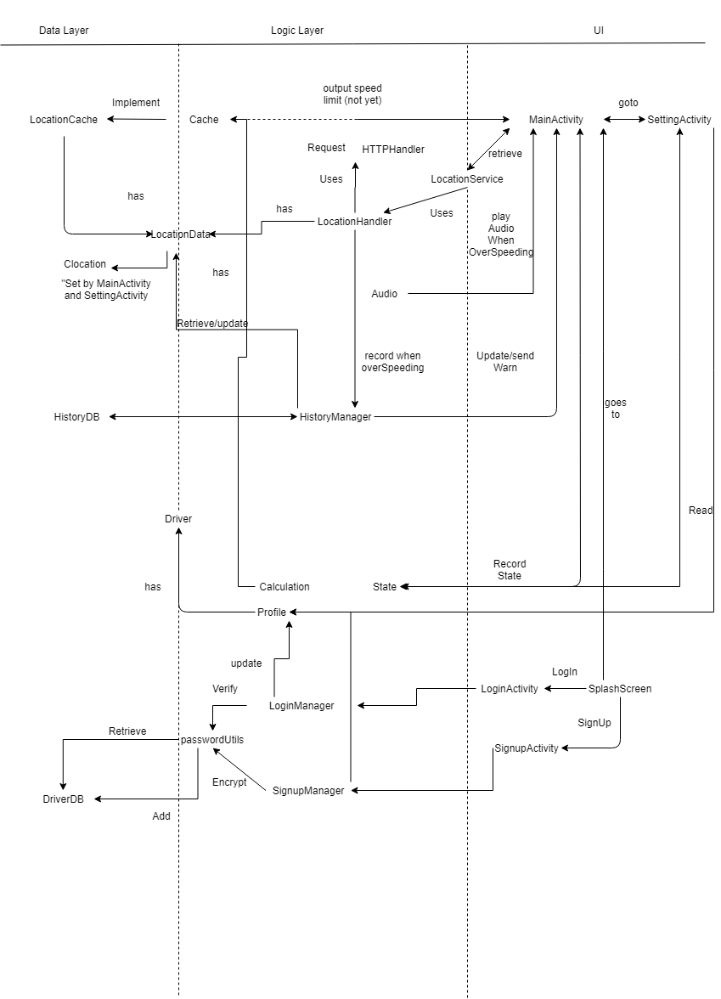

**Ojects:**

Driver:

    Saves Driver's information(UserName,password,etc.).
    
LocationData:

    Saves longtude,latitude, speed limit and streetName.
    
CLocation:

    Able to covert speed and speedlimit to mph or kph 
    
**UI:**

MainActivity:

    UI that shows speed limit, and current speed, warning, and conduct audio.
    
SplashScreen: 

    The first page a user will see.
    
LoginActivity:

    Login page.
    
SignupActivity:

    Signup page.
    
SettingsActivity:

    UI that user can set their preference and see their profile.
    
**DataBase:**

HistoryDB:

    Database implementation for ILocationHistoryDB. Saves overSpeeding area name.
    
DriverDB:

    Database implementation for IDriverDB. Saves user information.
    
**Logic:**

Cache:

    ILocationCache implentation, logic component. Checks duplicate, validate.
    
State:

    Saves the state of the System. Contains user's setting, and overSpeeding status.
    
Calculation:

    Contains Rad to Degree, and distance calculation methods.
    
HTTPSHandler:

    Get response from API.
    
Profile:

    Stores the current login user(Driver).
    
PasswordUtils:

    Encrypt password, verify encrypted password.
    
HistoryManager:

    Connects HistoryDB with UI.
    
LoginManager:

    Retrieve from DriverDB, and verify login success.
    
SignupManager:

    Based on userInput, verify and add to DriverDB.
    
Audio:

    Class that manages what audio will be play.
    
LocationService:

    Extends Serivices. Stop and start getting user speed and speed limits.
    
LocationHandler:

    Used by location services to update HistoryDB and making requests.
    
Request:

    API request handler. Used for getting speedLimit
    
